# 仿《空洞骑士》项目报告

## 1. 项目简介

《空洞骑士》游戏背景设定在一个错综复杂的地下城“圣巢”，我们的英雄在这个地下王国内开始了他的历险，他需要利用自己的能力探索遗迹、消灭怪物或者和一些怪物做朋友来帮助自己。游戏强调操作技巧和探索发现，拥有一定的难度。

我们项目的目的是复刻空洞骑士，然后在此基础之上加一些不一样的内容。比如，游戏地图与原版不一样，操作技能的数值略有区别，机制不一样等等，融入一些自己的想法。

## 2. 游戏创意

《空洞骑士》的核心玩法在于探索、战斗、跑酷，因此，我们对每个部分都有投入制作。游戏中，战斗攻击怪物主要通过普通攻击，但这个攻击具有方向性，可以上下左右 4 个方向对怪物进行攻击。玩家攻击怪物可以恢复能量，使用能量可以使出技能、恢复血量，所以鼓励玩家积极与怪物交互，获得爽快的战斗体验。

关于跑酷、探索，游戏中要制作箱庭式的地图，在地图中放上各种陷阱。当玩家踩到陷阱会强制回到上一个安全的位置，但是有趣的地方在于陷阱本身是跑酷的一环：通过下劈攻击陷阱让玩家获得一个反冲力，以通过各种看似不可能通过的区域，而连续下劈成功带来的反馈让玩家上瘾，不断挑战自己打出帅气的操作。

整体游戏偏难，但我们的设计是先简单后困难。最开始的关卡是一个教学关卡较轻松，而后面两个关卡分别是高难度的跑酷与战斗，需要较高熟练度来通关。

## 3. 游戏各模块介绍

### （1）小骑士动作（小骑士就是玩家）

作为主控角色，拥有非常多的动作，下面是管理动作的 animator 状态图：

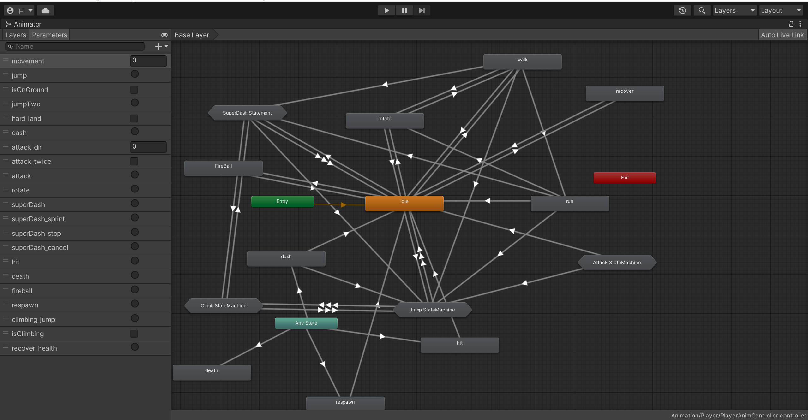

- Jump 动作、Climb 动作、SuperDash 动作、Attack 动作全部作为子状态机，可以让状态图简单一些。
- JumpStateMachine：处理二段跳、下落、落地、跳跃动作转换。
- AttackMachine：四个方向的攻击，水平方向还有连招效果。
- ClimbMachine：攀爬、墙上蹬墙跳。
- SuperDashMachine：超级冲刺蓄力准备、蓄力完成循环、释放、结束，还要考虑在墙上的超级冲刺有不一样的效果：在墙上超级冲刺动画不一样。

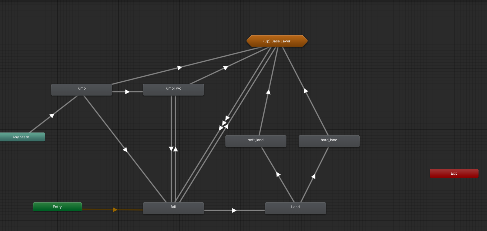
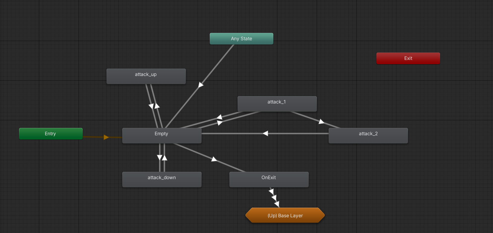
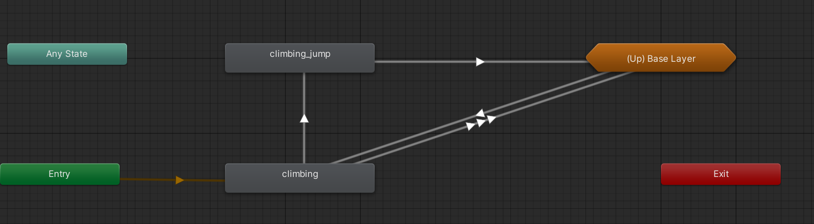
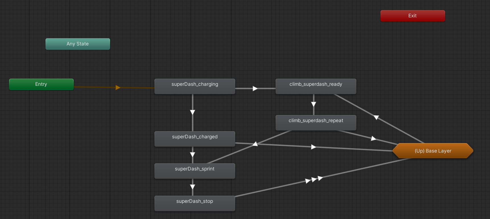

状态转换示例：大部分的状态转换都是没有 Exit time 的，让动画切换更加流畅，2D 游戏不太需要动画的过渡，过渡直接包含在动画本身了。

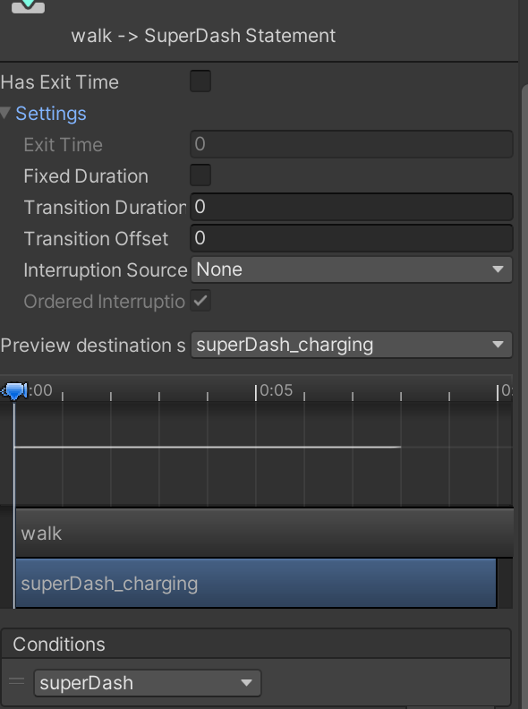

另外，状态转换时会出现一些 BUG：动画通过 AnyState 瞬间切换过去之后，原来的动画参数没有重置，导致再次触发时效果异常。我在这里通过给 Animator 的状态加上脚本处理离开状态、进入状态时的逻辑。

比如 JumpStateMachine 中，Fall 这个状态会循环播放下落音效。如果突然受伤进入 hit 状态，PlayerController 代码中不方便设置取消下落音效，而在 Animator 中的 Fall 状态加上一个 FallingStateBehavior 脚本：

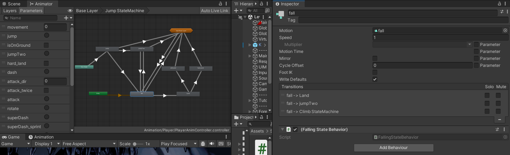

```csharp
public override void OnStateEnter(Animator animator, AnimatorStateInfo stateInfo, int layerIndex)
{
	if (!hasInitialized) Initialize(animator);
	playerSound.SetFallingState(true);
}

public override void OnStateExit(Animator animator, AnimatorStateInfo stateInfo, int layerIndex)
{
	if (!hasInitialized) Initialize(animator);
	playerSound.SetFallingState(false);
}
```

通知 Fall 状态取消，停止播放下落音效。而一旦进入 fall 状态，又开始播放，非常的方便！

小骑士 Prefab 设计：

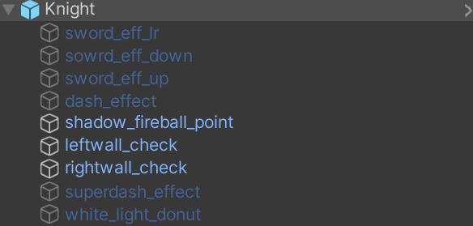

将一些特效（攻击剑气特效、冲刺特效）和攀爬检测、攻击点作为子物体，一些物体的开关在小骑士的相应动画关键帧中控制，比如攻击动画播放时打开 sword，sword 执行碰撞检测攻击怪物或陷阱。

小骑士脚本：

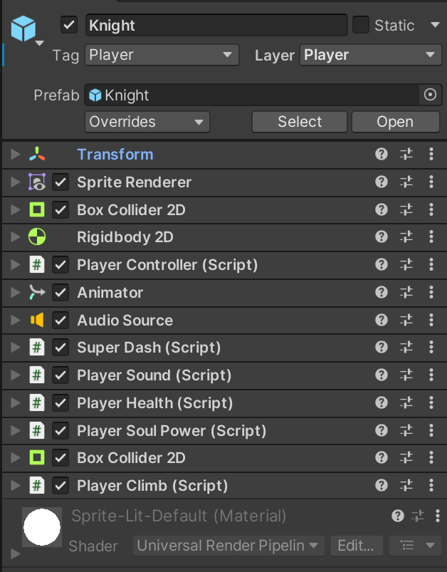
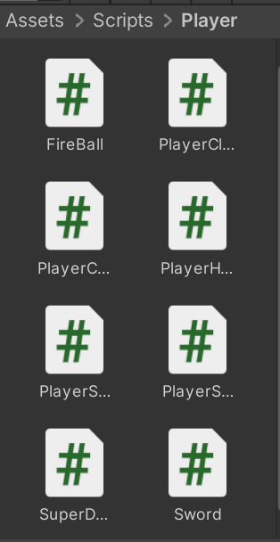

运动方面采用 RigidBody2D 的 velocity、force 来模拟，其它技能都单独开一个脚本模块，可以方便地开关某些能力，比如 PlayerClimb 脚本管理玩家的攀爬能力。各个脚本就不详细介绍了。

其它陷阱、物体的 Prefab：

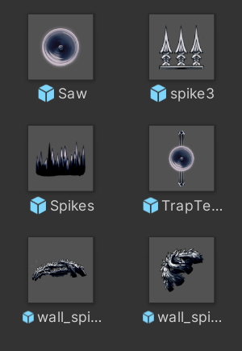
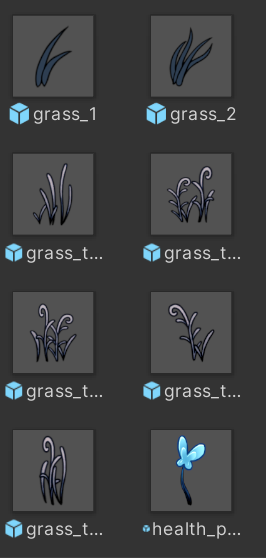

其中陷阱也有自己的脚本，主要是当玩家碰到陷阱，会调用玩家的 PlayerHealth 脚本的 LoseHealth 脚本，伤害类型是陷阱，玩家会受伤并回到上一个安全的位置。陷阱脚本按继承的思想设计，TrapBase 是所有陷阱的基类，其它陷阱由此派生，比如可移动的电锯、普通电锯、普通荆棘。

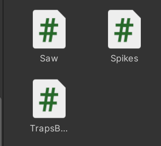

### （2）场景设计

2D 游戏地图的关键在于分层，各种图像分层叠加，展现出最后的游戏场景。我在地图的关键设计是利用 SpriteRender 组件中的 SortingLayers，将游戏分为 5 层。

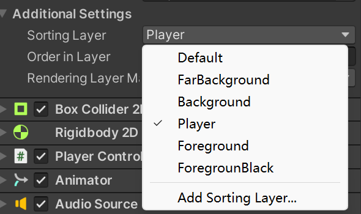

将前景、玩家、背景、遮罩 mask 层分配在这些层里面，实现多层的视觉效果。

下面是场景层级图（第一关地图，后面的地图也类似这样）。

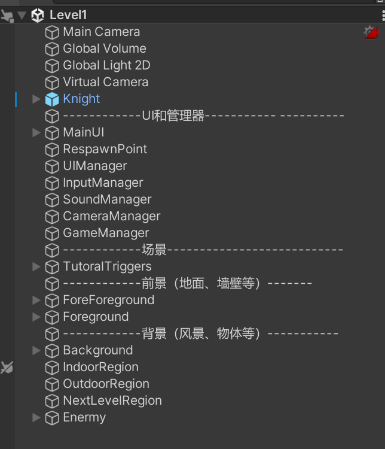

具体摆放的样子：有非常多的物体，搭建场景纯靠堆叠 Sprite，工作量很大。

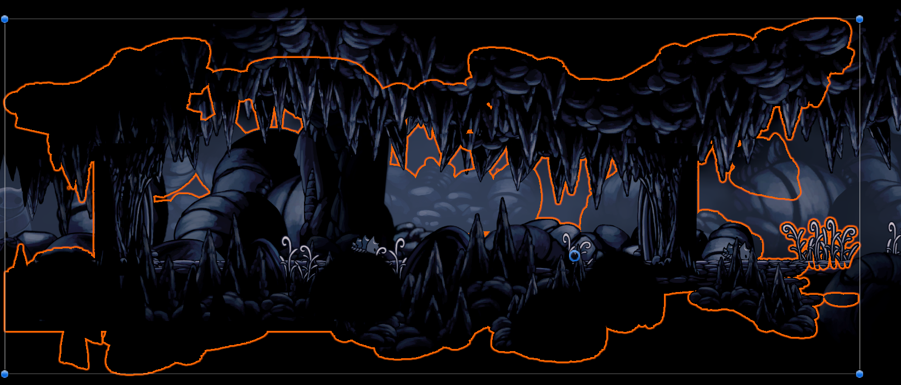

其中，Fog 效果可以夹在 Background 与 FarBackground 层之间，营造一种特殊的氛围。

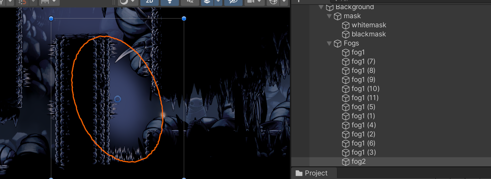

除了普通场景，在切换场景时我还做了类似黑屏加载那种效果（原版没有这个图片是纯黑的，这是我自己加的）。

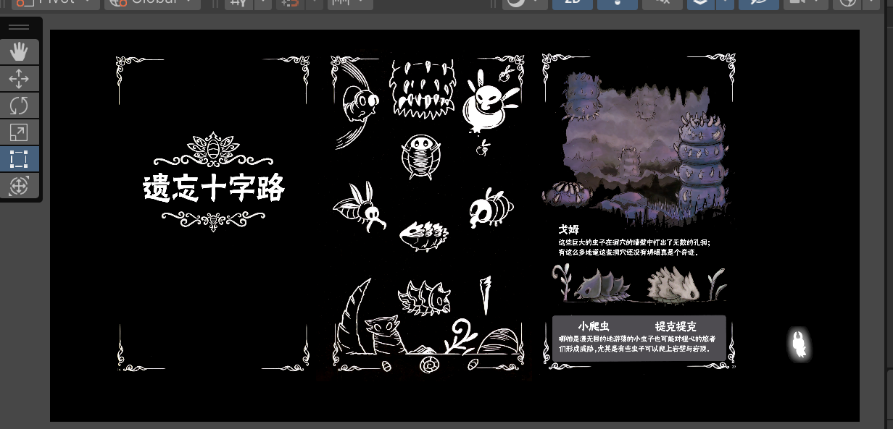

### （3）地图

我做了前两关，第一关的总览地图。

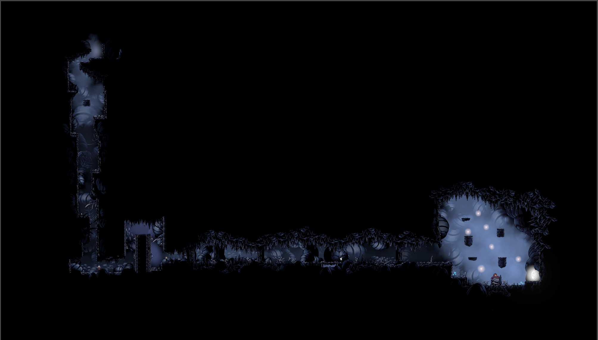

第二关（跑酷关）的地图（地图非常大）：右下角是终点，左半部分是房间内，右半部分是外面，云层是背景层，屋内的窗户可以看到云朵，这是用纯色遮罩（在不同层）实现的。陷阱非常多，但路线选择也多（演示视频有提到多种通关路线），总体上很难。

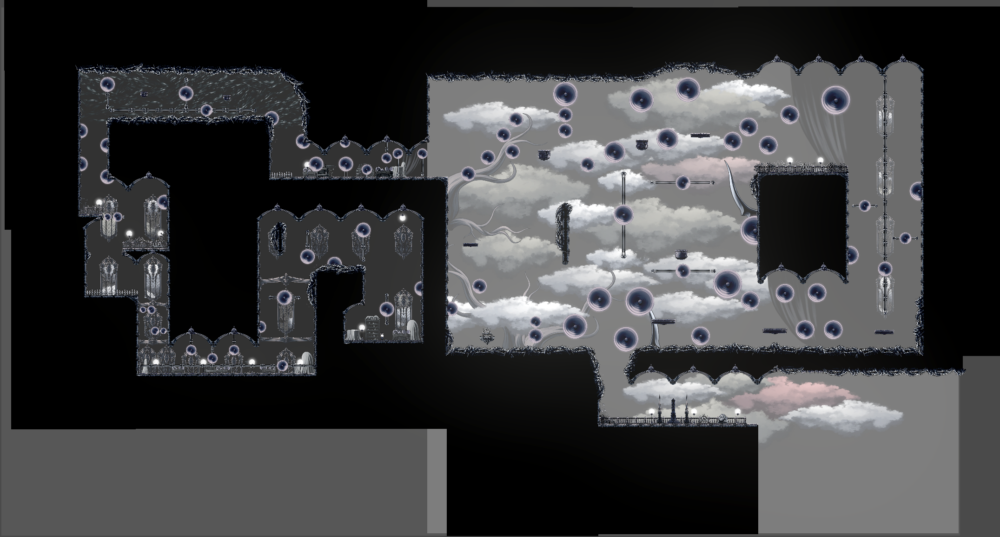

### （4）UI

我还制作了 UI，素材来自于原版游戏。各种 UI 的切换通过 button 调用一个 UIManager 物体中的单例脚本 `UIManager.cs` 中的函数来实现。

- 开始场景
- 点击选项（游戏、音量、视频这些选项没做，没时间了）
- 玩家 HUD（生命值和能量槽）
- 引导 UI
- 暂停 UI

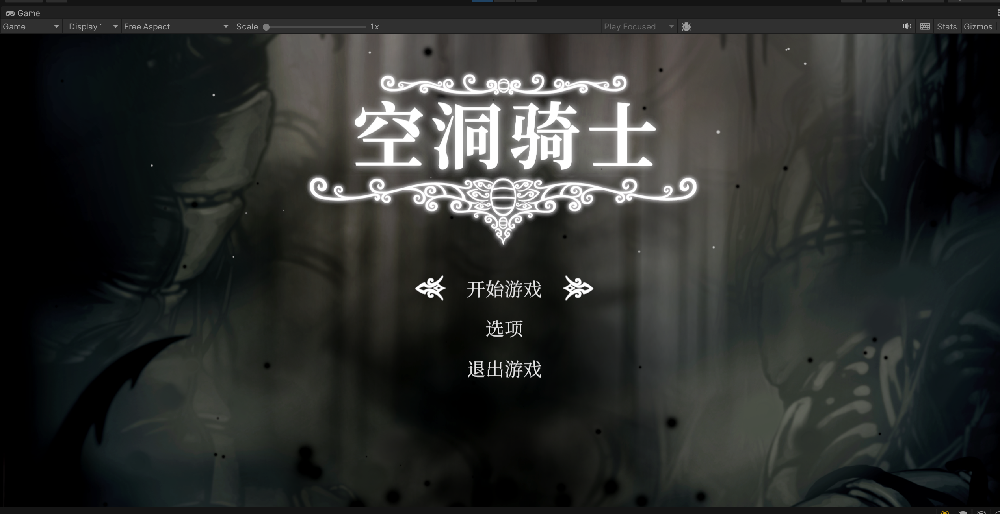
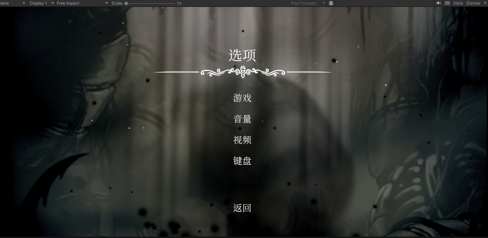
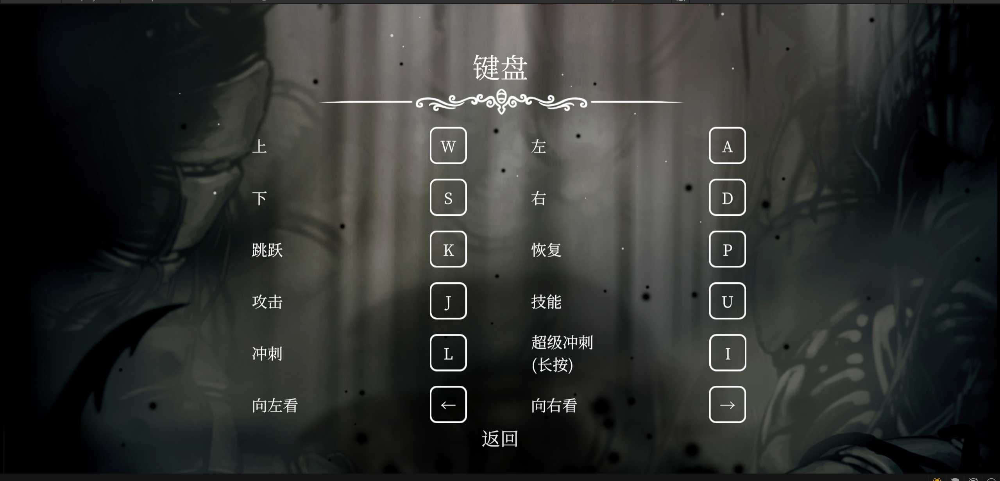
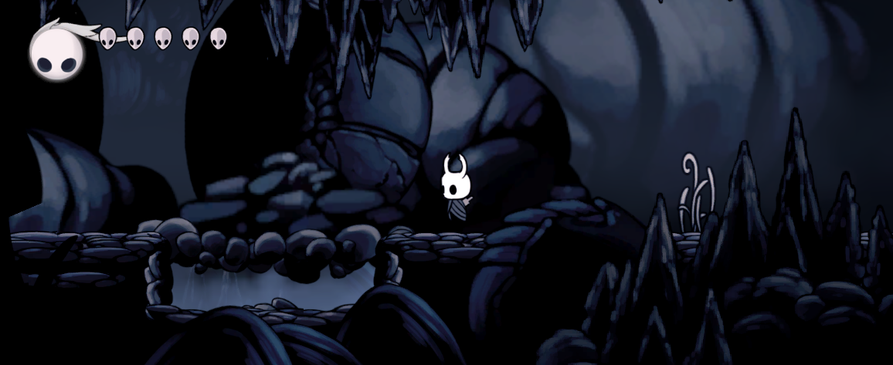
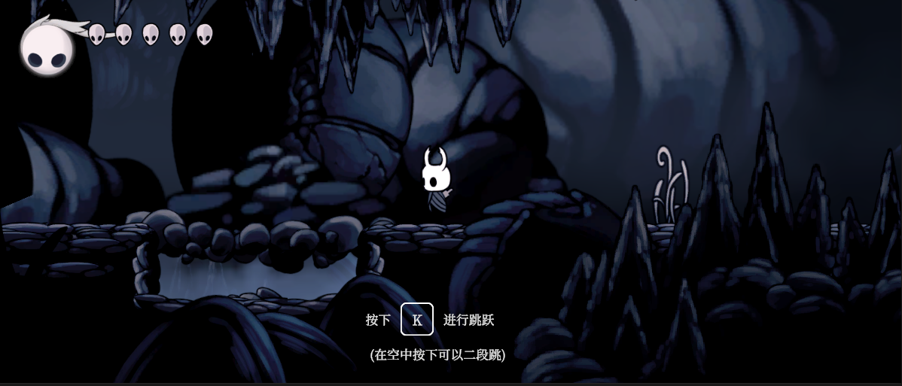
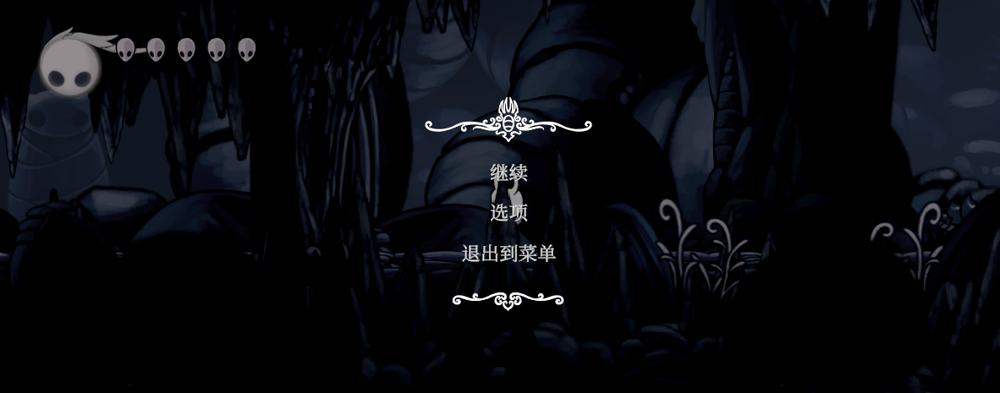

### （5）粒子特效

粒子特效采用 ParticleSystem，使用了非常多的 2D shader 材质。

Shader 很多是网上找的 2D shader 包（具体效果在视频中可以看到）。

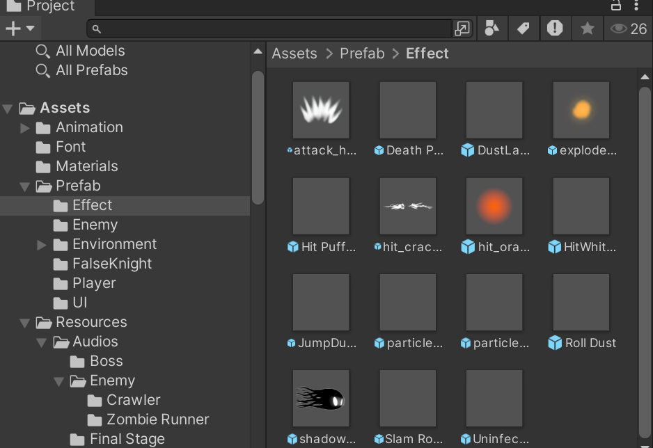
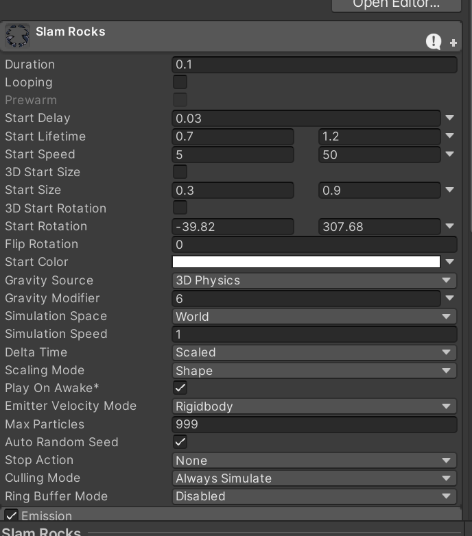

## 4. 核心编程模块（仅介绍核心的代码内容）

### （1）玩家控制

核心逻辑：

```csharp
// 处理所有输入
private void HandleInput()
{
	HandleMovementInput();
	HandleDashInput();
	HandleAttackInput();
	HandleFireBallInput();
}

void Update()
{
	HandleInput();
	switch (currentState)
	{
		case PlayerState.Movement:
			// 处理移动状态的逻辑
			Movement();
			Direction();
			Jump();
			break;
		case PlayerState.Dash:
			// 处理冲刺状态的逻辑
			Dash();
			break;
		case PlayerState.Attack:
			// 处理攻击状态的逻辑
			AttackMove();
			break;
		case PlayerState.SuperDash:
			// 处理超级冲刺状态的逻辑
			break;
		case PlayerState.FireBall:
			// 处理火球状态的逻辑
			break;
		case PlayerState.Climb:
			// 处理攀爬状态的逻辑
			break;
	}
}
```

处理输入逻辑 HandleInput，根据玩家状态 switch case 执行相应代码逻辑。其中我认为比较难的是实现跳跃，跳跃根据玩家按下 K 键的时长来控制跳跃高度，还有二段跳的功能，我使用 rigidbody 的 AddForce 来模拟这些。处理步骤分为 3 个阶段，GetKeyDown() -> GetKey() -> GetKeyUp()，长按在 GetKey 中处理，会持续向玩家施加向上的力。

另外，为了模拟那种按的时间前面升力大后面小，我还增加了一个字段 jumpForceCurve，自定义动画曲线实现这种效果。

```csharp
private void Jump()
{
	bool jumpDown = (InputManager.instance != null)
		? InputManager.instance.GetButtonDown(InputManager.GameButton.Jump)
		: Input.GetKeyDown(KeyCode.K);

	if (jumpDown)
	{
		if (isOnGround)
		{
			// 记录跳跃前的安全点为当前 ground collider 的平台顶部（优先），如果该平台是可移动的则不记录
			if (currentGroundCollider != null)
			{
				SetSafePositionFromCollider(currentGroundCollider);
			}
			else
			{
				UpdateSafePositionToPlatformTop();
			}

			jumpPressTime = 0f;
			canJumpTwice = true; // 在地面时重置二段跳
			isJumping = true;
			hardLand = false; // 重置硬着陆状态
			anim.SetBool("hard_land", hardLand);
			anim.SetTrigger("jump");
			anim.ResetTrigger("jumpTwo");
			SoundManager.instance.PlaySound(SoundIndex.player_jump);
		}
		else if (canJumpTwice)
		{
			jumpPressTime = 0f;
			canJumpTwice = false; // 只能二段跳一次
			isJumping = false;
			DoubleJump();
		}
	}

	bool jumpHeld = (InputManager.instance != null)
		? InputManager.instance.GetButton(InputManager.GameButton.Jump)
		: Input.GetKey(KeyCode.K);

	if (jumpHeld && isJumping)
	{
		jumpPressTime += Time.deltaTime;
		jumpPressTime = Mathf.Min(jumpPressTime, maxJumpPressTime);
		float jumpForceFactor = jumpForceCurve.Evaluate(jumpPressTime / maxJumpPressTime);
		rb.AddForce(new Vector2(0, jumpForce * jumpForceFactor * Time.deltaTime), ForceMode2D.Force);
	}

	bool jumpUp = (InputManager.instance != null)
		? InputManager.instance.GetButtonUp(InputManager.GameButton.Jump)
		: Input.GetKeyUp(KeyCode.K);

	if (jumpUp)
	{
		jumpPressTime = 0f;
		isJumping = false;
		JumpCancel();
	}
}
```

### （2）玩家生命值

在 PlayerHealth 脚本，制作了让玩家掉血的核心逻辑：

```csharp
public void TakeDamage(int damage, DamageType damageType = DamageType.NormalDamage)
{
	if (isInvincible)
		return;

	damage = Mathf.RoundToInt(damage * (1.0f - damageReductionRate));
	damage = Mathf.Min(damage, current_health);
	current_health -= damage;

	// 生成受伤特效
	Instantiate(player_hit_particle, transform.position, Quaternion.identity);

	if (current_health <= 0)
	{
		// 死亡
		HealthUIMgr.Instance.LoseHealth(current_health, damage, max_health);
		playerController.enabled = false;
		rb2d.velocity = Vector2.zero;
		rb2d.simulated = false;
		animator.SetTrigger("death");
		SoundManager.instance.PlaySound(SoundIndex.player_death);
	}
	else
	{
		// 提示回血
		TutorialUI.instance.ShowTutorial(TutorialUITyepe.Recover, 10f);

		// 进入无敌状态
		isInvincible = true;
		StartCoroutine(InvincibleTimer());

		// 受伤动画
		animator.SetTrigger("hit");
		SoundManager.instance.PlaySound(SoundIndex.player_injured);
		playerController.ResetAllParameters();
		playerController.enabled = false;
		rb2d.velocity = Vector2.zero;

		// UI 生命值受伤
		HealthUIMgr.Instance.LoseHealth(current_health, damage, max_health);

		// 如果是陷阱伤害，立即重置到最近的安全位置
		if (damageType == DamageType.TrapDamage)
		{
			StartCoroutine(RespawnAndInvincible());
		}
	}
}
```

玩家掉血会影响到 HUD 中的生命值显示、动画状态转换、开启一个进入无敌状态的协程、引导 UI 的按键提示，还要根据受伤类型来判断是否需要重置到最近的安全位置。

### （3）玩家下劈的反冲实现

跑酷需要玩家下劈攻击陷阱，当成功命中，反弹并重置二段跳。

在 PlayerController 脚本开放一个反冲接口：

```csharp
/// <summary>
/// 给玩家一个反冲的力
/// </summary>
public void ApplyKnockback(float force, Vector2 direction)
{
	rb.velocity = new Vector2(rb.velocity.x, 0);
	rb.AddForce(direction * force, ForceMode2D.Impulse);

	// 反冲之后，会重置二段跳
	canJumpTwice = true;
}
```

在玩家的攻击（Sword 脚本）命中到陷阱：计算反冲方向后调用 PlayerController 的接口。

```csharp
void OnTriggerEnter2D(Collider2D collision)
{
	if (collision.tag == "Traps")
	{
		// 剑气命中陷阱在击中点产生特效
		// 根据接触点法线方向产生特效（通过碰撞体中心到最近点向量近似法线）
		Vector2 hitPoint = collision.ClosestPoint(transform.position);
		Vector2 normal;

		// 使用碰撞体包围盒中心到命中点的方向近似法线
		Vector2 center = collision.bounds.center;
		normal = (hitPoint - center).normalized;
		if (normal.sqrMagnitude < 0.001f)
		{
			normal = Vector2.up;
		}

		Quaternion rot = Quaternion.FromToRotation(Vector3.up, normal);
		Instantiate(hitEffect, hitPoint, rot);
		SoundManager.instance.PlaySound(SoundIndex.player_hitRecoil);

		Vector2 knockbackDirection = GetAttackDirection();

		// 给玩家一个反冲的力
		playerController.ApplyKnockback(knockbackForce, knockbackDirection);

		// 恢复 5 点能量
		playerSoulPower.AddSoulPower(5);

		// 销毁剑气
		this.enabled = false;
	}
}
```

### （4）音效管理

游戏中的声音通过一个单例脚本 SoundManager 管理：

```csharp
public static SoundManager instance;
private AudioSource audioSource;
public AudioClip defaultBGM;
public string currentBGM = "";

private void Awake()
{
	instance = this;
	audioSource = GetComponent<AudioSource>();
}

public void PlaySound(string soundName, float volume = 1.0f)
{
	AudioClip clip = Resources.Load<AudioClip>($"Audios/{soundName}");
	if (clip != null)
	{
		audioSource.PlayOneShot(clip, volume);
	}
	else
	{
		Debug.LogWarning($"Sound {soundName} not found!");
	}
}
```

其它脚本可以方便地调用。另外，我还制作了一个纯数据脚本 SoundIndex 存放各个音效的路径以更加方便地调用：

```csharp
public const string player_jump = "Player/PlayerJump";
public const string player_run = "Player/PlayerRun";
public const string player_softLand = "Player/PlayerSoftLand";
public const string player_hitRecoil = "Player/PlayerHitRecoil";
```

调用实例（调用玩家跳跃的音效）：

```csharp
SoundManager.instance.PlaySound(SoundIndex.player_jump);
```

### （5）玩家攀爬 PlayerClimb 脚本

这个是非常复杂的一个功能，但通过有限状态机的设计思路，我做到了。

主函数：

```csharp
void Update()
{
	switch (currentClimbState)
	{
		case ClimbState.None:
			HandleNoneState();
			break;
		case ClimbState.Jumping:
			HandleJumpingState();
			break;
		case ClimbState.Climbing:
			HandleClimbingState();
			break;
		case ClimbState.ClimbJumping:
			HandleClimbJumpingState();
			break;
	}
}
```

爬墙检测 CheckWall：使用物理射线判断玩家是否贴在墙上，如果是，方向是左是右。

```csharp
void CheckWall()
{
	isFacingRight = transform.localScale.x < 0;

	// 从检测点向左侧发射一条很短的射线
	if (isFacingRight)
	{
		// 面向右侧，左检测点检测右边墙壁
		isTouchingLeftWall = Physics2D.Raycast(rightWallCheck.position, Vector2.left, wallCheckDistance, wallLayer);
		isTouchingRightWall = Physics2D.Raycast(leftWallCheck.position, Vector2.right, wallCheckDistance, wallLayer);
	}
	else
	{
		// 面向左侧，右检测点检测右边墙壁
		isTouchingLeftWall = Physics2D.Raycast(leftWallCheck.position, Vector2.left, wallCheckDistance, wallLayer);
		isTouchingRightWall = Physics2D.Raycast(rightWallCheck.position, Vector2.right, wallCheckDistance, wallLayer);
	}
}
```

处理各个状态的函数 Handle..State：

```csharp
private void HandleJumpingState()
{
	CheckIsJumping();
	if (!isJumping)
	{
		JumpingToNone();
		return;
	}

	// 需要射线检测，检测可不可以攀爬
	CheckWall();
	inputX = Input.GetAxisRaw("Horizontal");
	inputY = Input.GetAxisRaw("Vertical");
	if ((isTouchingLeftWall && inputX < -0.1f) || (isTouchingRightWall && inputX > 0.1f))
	{
		JumpingToClimbing();
	}
}
```

处理各个可能的转换（JumpingToClimbing 等等）：

```csharp
private void JumpingToClimbing()
{
	if (!canClimb) return;
	currentClimbState = ClimbState.Climbing;
	animator.SetBool("isClimbing", true);

	// 播放攀爬音效
	audioSource.clip = climbSlideSound;
	audioSource.loop = true;
	audioSource.Play();

	playerController.OnClimbStart();
}
```

这样，功能完善，代码清晰，便于维护。

其它代码还有很多，CameraManager、GameManager、UIManager……就不介绍了。

## 5. 运行环境配置及游戏测试

PC 运行环境，游戏测试如下：

- 开始菜单
- 加载 1
- 第一关
- 加载 2
- 第二关
- 加载 3
- 第三关
- 运行数据

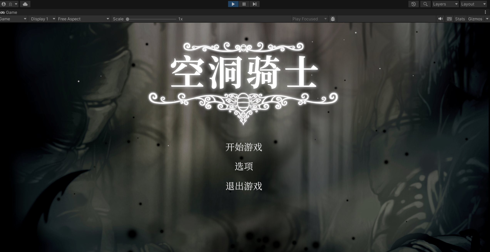
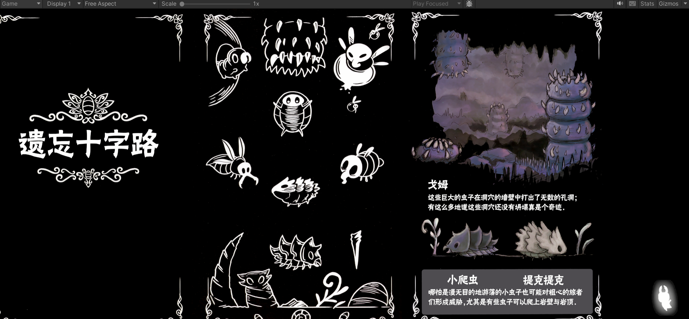
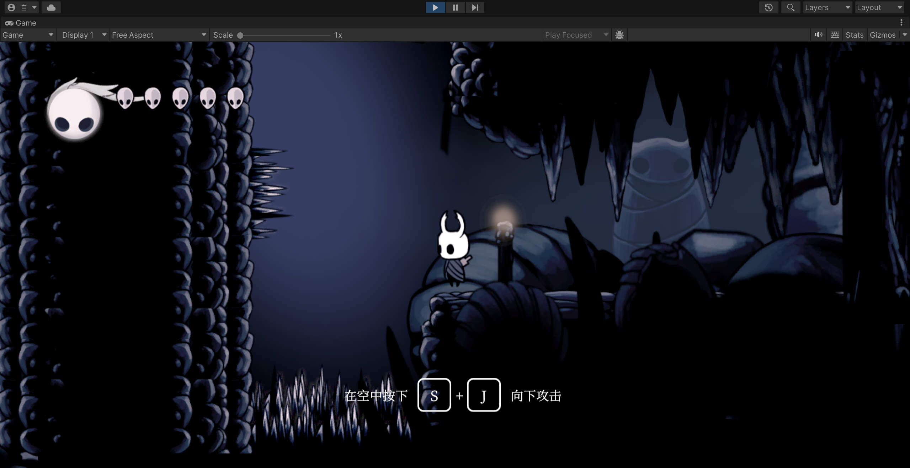
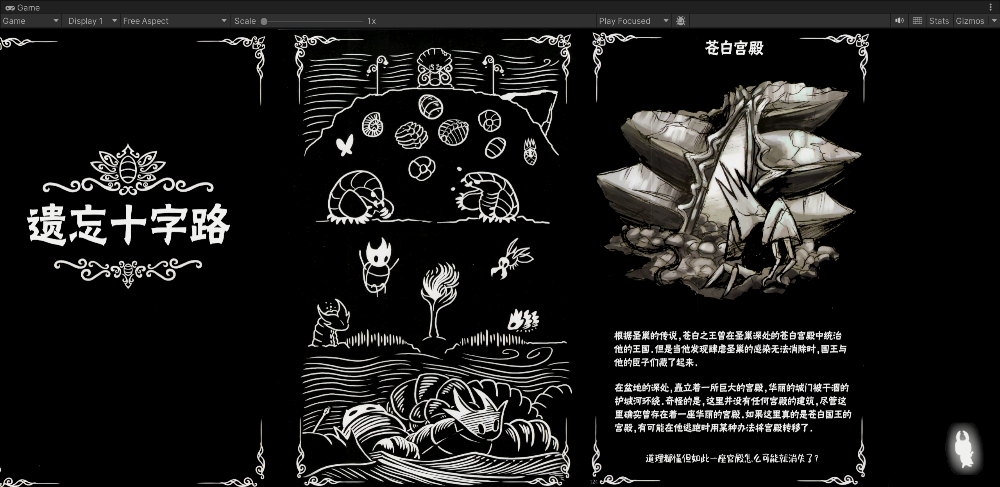
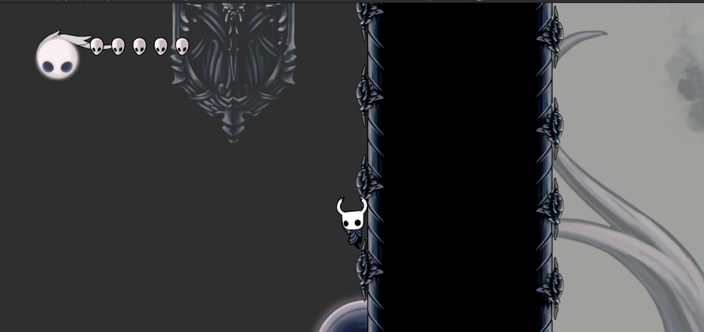
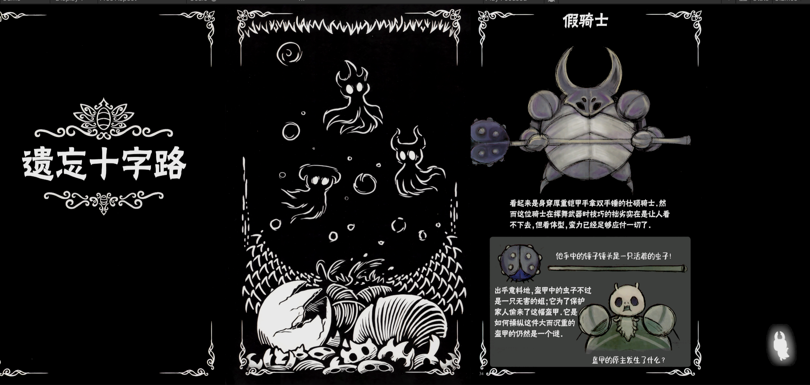
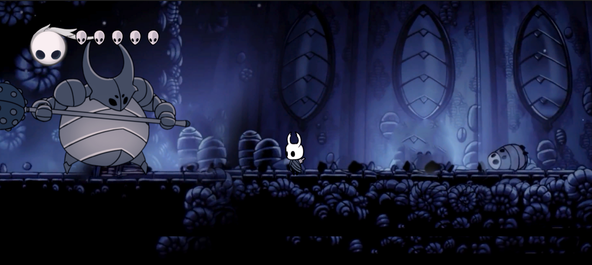
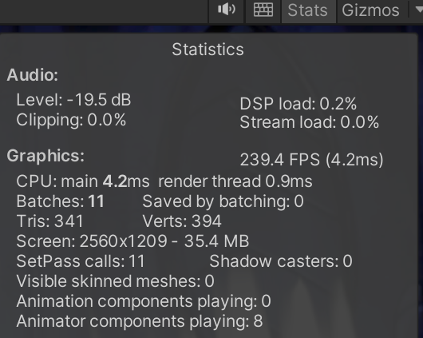

