# 仿《空洞骑士》项目报告

## 1. 项目简介

《空洞骑士》游戏背景设定在一个错综复杂的地下城“圣巢”，我们的英雄在这个地下王国内开始了他的历险，他需要利用自己的能力探索遗迹、消灭怪物或者和一些怪物做朋友来帮助自己。游戏强调操作技巧和探索发现，拥有一定的难度。

我们项目的目的是复刻空洞骑士，然后在此基础之上加一些不一样的内容。比如，游戏地图与原版不一样，操作技能的数值略有区别，机制不一样等等，融入一些自己的想法。

**总体概览**

技术栈：Unity、C#、Lua、ToLua、Addressables、UGUI、JSON

架构与能力：Lua UI 框架、资源管理与热更新、对象池、存档系统、数据驱动配置、编辑器自动工具


**游玩展示**

第一关-小怪战斗

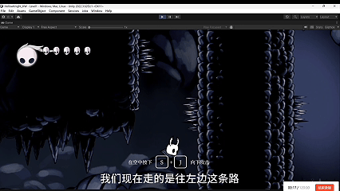

第一关-简单跑酷

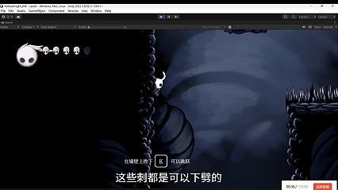

第一关-精英小怪

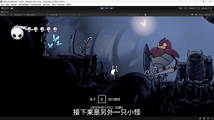


第二关-跑酷1

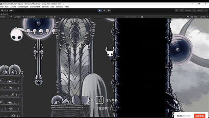

第二关-跑酷2

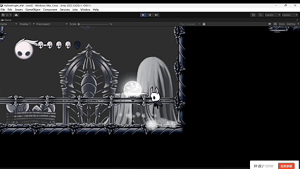

第二关-跑酷3

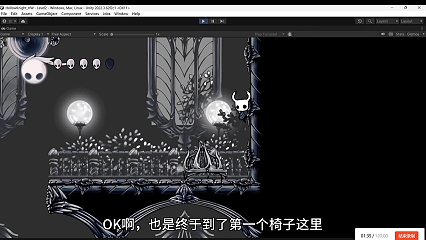

第二关-跑酷4

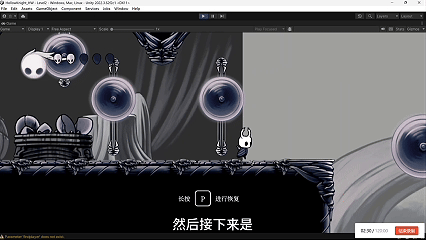

第二关-通关

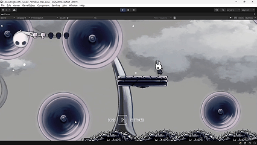

第三关-阶段

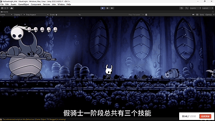

第三关-二阶段

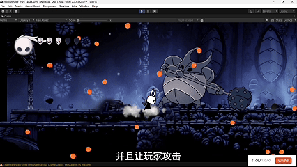

## 2. 游戏创意

《空洞骑士》的核心玩法在于探索、战斗、跑酷，因此，我们对每个部分都有投入制作。游戏中，战斗攻击怪物主要通过普通攻击，但这个攻击具有方向性，可以上下左右 4 个方向对怪物进行攻击。玩家攻击怪物可以恢复能量，使用能量可以使出技能、恢复血量，所以鼓励玩家积极与怪物交互，获得爽快的战斗体验。

关于跑酷、探索，游戏中要制作箱庭式的地图，在地图中放上各种陷阱。当玩家踩到陷阱会强制回到上一个安全的位置，但是有趣的地方在于陷阱本身是跑酷的一环：通过下劈攻击陷阱让玩家获得一个反冲力，以通过各种看似不可能通过的区域，而连续下劈成功带来的反馈让玩家上瘾，不断挑战自己打出帅气的操作。

整体游戏偏难，但我们的设计是先简单后困难。最开始的关卡是一个教学关卡较轻松，而后面两个关卡分别是高难度的跑酷与战斗，需要较高熟练度来通关。

## 3. 游戏各模块介绍

### （1）小骑士动作（小骑士就是玩家）

作为主控角色，拥有非常多的动作，下面是管理动作的 animator 状态图：


- Jump 动作、Climb 动作、SuperDash 动作、Attack 动作全部作为子状态机，可以让状态图简单一些。
- JumpStateMachine：处理二段跳、下落、落地、跳跃动作转换。
- AttackMachine：四个方向的攻击，水平方向还有连招效果。
- ClimbMachine：攀爬、墙上蹬墙跳。
- SuperDashMachine：超级冲刺蓄力准备、蓄力完成循环、释放、结束，还要考虑在墙上的超级冲刺有不一样的效果：在墙上超级冲刺动画不一样。


状态转换示例：大部分的状态转换都是没有 Exit time 的，让动画切换更加流畅，2D 游戏不太需要动画的过渡，过渡直接包含在动画本身了。


另外，状态转换时会出现一些 BUG：动画通过 AnyState 瞬间切换过去之后，原来的动画参数没有重置，导致再次触发时效果异常。我在这里通过给 Animator 的状态加上脚本处理离开状态、进入状态时的逻辑。

比如 JumpStateMachine 中，Fall 这个状态会循环播放下落音效。如果突然受伤进入 hit 状态，PlayerController 代码中不方便设置取消下落音效，而在 Animator 中的 Fall 状态加上一个 FallingStateBehavior 脚本：


```csharp
public override void OnStateEnter(Animator animator, AnimatorStateInfo stateInfo, int layerIndex)
{
	if (!hasInitialized) Initialize(animator);
	playerSound.SetFallingState(true);
}

public override void OnStateExit(Animator animator, AnimatorStateInfo stateInfo, int layerIndex)
{
	if (!hasInitialized) Initialize(animator);
	playerSound.SetFallingState(false);
}
```

通知 Fall 状态取消，停止播放下落音效。而一旦进入 fall 状态，又开始播放，非常的方便！

小骑士 Prefab 设计：


将一些特效（攻击剑气特效、冲刺特效）和攀爬检测、攻击点作为子物体，一些物体的开关在小骑士的相应动画关键帧中控制，比如攻击动画播放时打开 sword，sword 执行碰撞检测攻击怪物或陷阱。

小骑士脚本：


运动方面采用 RigidBody2D 的 velocity、force 来模拟，其它技能都单独开一个脚本模块，可以方便地开关某些能力，比如 PlayerClimb 脚本管理玩家的攀爬能力。各个脚本就不详细介绍了。

其它陷阱、物体的 Prefab：


其中陷阱也有自己的脚本，主要是当玩家碰到陷阱，会调用玩家的 PlayerHealth 脚本的 LoseHealth 脚本，伤害类型是陷阱，玩家会受伤并回到上一个安全的位置。陷阱脚本按继承的思想设计，TrapBase 是所有陷阱的基类，其它陷阱由此派生，比如可移动的电锯、普通电锯、普通荆棘。


### （2）场景设计

2D 游戏地图的关键在于分层，各种图像分层叠加，展现出最后的游戏场景。我在地图的关键设计是利用 SpriteRender 组件中的 SortingLayers，将游戏分为 5 层。


将前景、玩家、背景、遮罩 mask 层分配在这些层里面，实现多层的视觉效果。

下面是场景层级图（第一关地图，后面的地图也类似这样）。


具体摆放的样子：有非常多的物体，搭建场景纯靠堆叠 Sprite，工作量很大。


其中，Fog 效果可以夹在 Background 与 FarBackground 层之间，营造一种特殊的氛围。


除了普通场景，在切换场景时我还做了类似黑屏加载那种效果（原版没有这个图片是纯黑的，这是我自己加的）。


### （3）地图

我做了前两关，第一关的总览地图。


第二关（跑酷关）的地图（地图非常大）：右下角是终点，左半部分是房间内，右半部分是外面，云层是背景层，屋内的窗户可以看到云朵，这是用纯色遮罩（在不同层）实现的。陷阱非常多，但路线选择也多（演示视频有提到多种通关路线），总体上很难。


### （4）UI

我还制作了 UI，素材来自于原版游戏。各种 UI 的切换通过 button 调用一个 UIManager 物体中的单例脚本 `UIManager.cs` 中的函数来实现。

- 开始场景
- 点击选项（游戏、音量、视频这些选项没做，没时间了）
- 玩家 HUD（生命值和能量槽）
- 引导 UI
- 暂停 UI


### （5）粒子特效

粒子特效采用 ParticleSystem，使用了非常多的 2D shader 材质。

Shader 很多是网上找的 2D shader 包（具体效果在视频中可以看到）。


## 4. 核心编程模块（仅介绍核心的代码内容）

### （1）玩家控制

核心逻辑：

```csharp
// 处理所有输入
private void HandleInput()
{
	HandleMovementInput();
	HandleDashInput();
	HandleAttackInput();
	HandleFireBallInput();
}

void Update()
{
	HandleInput();
	switch (currentState)
	{
		case PlayerState.Movement:
			// 处理移动状态的逻辑
			Movement();
			Direction();
			Jump();
			break;
		case PlayerState.Dash:
			// 处理冲刺状态的逻辑
			Dash();
			break;
		case PlayerState.Attack:
			// 处理攻击状态的逻辑
			AttackMove();
			break;
		case PlayerState.SuperDash:
			// 处理超级冲刺状态的逻辑
			break;
		case PlayerState.FireBall:
			// 处理火球状态的逻辑
			break;
		case PlayerState.Climb:
			// 处理攀爬状态的逻辑
			break;
	}
}
```

处理输入逻辑 HandleInput，根据玩家状态 switch case 执行相应代码逻辑。其中我认为比较难的是实现跳跃，跳跃根据玩家按下 K 键的时长来控制跳跃高度，还有二段跳的功能，我使用 rigidbody 的 AddForce 来模拟这些。处理步骤分为 3 个阶段，GetKeyDown() -> GetKey() -> GetKeyUp()，长按在 GetKey 中处理，会持续向玩家施加向上的力。

另外，为了模拟那种按的时间前面升力大后面小，我还增加了一个字段 jumpForceCurve，自定义动画曲线实现这种效果。

```csharp
private void Jump()
{
	bool jumpDown = (InputManager.instance != null)
		? InputManager.instance.GetButtonDown(InputManager.GameButton.Jump)
		: Input.GetKeyDown(KeyCode.K);

	if (jumpDown)
	{
		if (isOnGround)
		{
			// 记录跳跃前的安全点为当前 ground collider 的平台顶部（优先），如果该平台是可移动的则不记录
			if (currentGroundCollider != null)
			{
				SetSafePositionFromCollider(currentGroundCollider);
			}
			else
			{
				UpdateSafePositionToPlatformTop();
			}

			jumpPressTime = 0f;
			canJumpTwice = true; // 在地面时重置二段跳
			isJumping = true;
			hardLand = false; // 重置硬着陆状态
			anim.SetBool("hard_land", hardLand);
			anim.SetTrigger("jump");
			anim.ResetTrigger("jumpTwo");
			SoundManager.instance.PlaySound(SoundIndex.player_jump);
		}
		else if (canJumpTwice)
		{
			jumpPressTime = 0f;
			canJumpTwice = false; // 只能二段跳一次
			isJumping = false;
			DoubleJump();
		}
	}

	bool jumpHeld = (InputManager.instance != null)
		? InputManager.instance.GetButton(InputManager.GameButton.Jump)
		: Input.GetKey(KeyCode.K);

	if (jumpHeld && isJumping)
	{
		jumpPressTime += Time.deltaTime;
		jumpPressTime = Mathf.Min(jumpPressTime, maxJumpPressTime);
		float jumpForceFactor = jumpForceCurve.Evaluate(jumpPressTime / maxJumpPressTime);
		rb.AddForce(new Vector2(0, jumpForce * jumpForceFactor * Time.deltaTime), ForceMode2D.Force);
	}

	bool jumpUp = (InputManager.instance != null)
		? InputManager.instance.GetButtonUp(InputManager.GameButton.Jump)
		: Input.GetKeyUp(KeyCode.K);

	if (jumpUp)
	{
		jumpPressTime = 0f;
		isJumping = false;
		JumpCancel();
	}
}
```

### （2）玩家生命值

在 PlayerHealth 脚本，制作了让玩家掉血的核心逻辑：

```csharp
public void TakeDamage(int damage, DamageType damageType = DamageType.NormalDamage)
{
	if (isInvincible)
		return;

	damage = Mathf.RoundToInt(damage * (1.0f - damageReductionRate));
	damage = Mathf.Min(damage, current_health);
	current_health -= damage;

	// 生成受伤特效
	Instantiate(player_hit_particle, transform.position, Quaternion.identity);

	if (current_health <= 0)
	{
		// 死亡
		HealthUIMgr.Instance.LoseHealth(current_health, damage, max_health);
		playerController.enabled = false;
		rb2d.velocity = Vector2.zero;
		rb2d.simulated = false;
		animator.SetTrigger("death");
		SoundManager.instance.PlaySound(SoundIndex.player_death);
	}
	else
	{
		// 提示回血
		TutorialUI.instance.ShowTutorial(TutorialUITyepe.Recover, 10f);

		// 进入无敌状态
		isInvincible = true;
		StartCoroutine(InvincibleTimer());

		// 受伤动画
		animator.SetTrigger("hit");
		SoundManager.instance.PlaySound(SoundIndex.player_injured);
		playerController.ResetAllParameters();
		playerController.enabled = false;
		rb2d.velocity = Vector2.zero;

		// UI 生命值受伤
		HealthUIMgr.Instance.LoseHealth(current_health, damage, max_health);

		// 如果是陷阱伤害，立即重置到最近的安全位置
		if (damageType == DamageType.TrapDamage)
		{
			StartCoroutine(RespawnAndInvincible());
		}
	}
}
```

玩家掉血会影响到 HUD 中的生命值显示、动画状态转换、开启一个进入无敌状态的协程、引导 UI 的按键提示，还要根据受伤类型来判断是否需要重置到最近的安全位置。

### （3）玩家下劈的反冲实现

跑酷需要玩家下劈攻击陷阱，当成功命中，反弹并重置二段跳。

在 PlayerController 脚本开放一个反冲接口：

```csharp
/// <summary>
/// 给玩家一个反冲的力
/// </summary>
public void ApplyKnockback(float force, Vector2 direction)
{
	rb.velocity = new Vector2(rb.velocity.x, 0);
	rb.AddForce(direction * force, ForceMode2D.Impulse);

	// 反冲之后，会重置二段跳
	canJumpTwice = true;
}
```

在玩家的攻击（Sword 脚本）命中到陷阱：计算反冲方向后调用 PlayerController 的接口。

```csharp
void OnTriggerEnter2D(Collider2D collision)
{
	if (collision.tag == "Traps")
	{
		// 剑气命中陷阱在击中点产生特效
		// 根据接触点法线方向产生特效（通过碰撞体中心到最近点向量近似法线）
		Vector2 hitPoint = collision.ClosestPoint(transform.position);
		Vector2 normal;

		// 使用碰撞体包围盒中心到命中点的方向近似法线
		Vector2 center = collision.bounds.center;
		normal = (hitPoint - center).normalized;
		if (normal.sqrMagnitude < 0.001f)
		{
			normal = Vector2.up;
		}

		Quaternion rot = Quaternion.FromToRotation(Vector3.up, normal);
		Instantiate(hitEffect, hitPoint, rot);
		SoundManager.instance.PlaySound(SoundIndex.player_hitRecoil);

		Vector2 knockbackDirection = GetAttackDirection();

		// 给玩家一个反冲的力
		playerController.ApplyKnockback(knockbackForce, knockbackDirection);

		// 恢复 5 点能量
		playerSoulPower.AddSoulPower(5);

		// 销毁剑气
		this.enabled = false;
	}
}
```

### （4）音效管理

游戏中的声音通过一个单例脚本 SoundManager 管理：

```csharp
public static SoundManager instance;
private AudioSource audioSource;
public AudioClip defaultBGM;
public string currentBGM = "";

private void Awake()
{
	instance = this;
	audioSource = GetComponent<AudioSource>();
}

public void PlaySound(string soundName, float volume = 1.0f)
{
	AudioClip clip = Resources.Load<AudioClip>($"Audios/{soundName}");
	if (clip != null)
	{
		audioSource.PlayOneShot(clip, volume);
	}
	else
	{
		Debug.LogWarning($"Sound {soundName} not found!");
	}
}
```

其它脚本可以方便地调用。另外，我还制作了一个纯数据脚本 SoundIndex 存放各个音效的路径以更加方便地调用：

```csharp
public const string player_jump = "Player/PlayerJump";
public const string player_run = "Player/PlayerRun";
public const string player_softLand = "Player/PlayerSoftLand";
public const string player_hitRecoil = "Player/PlayerHitRecoil";
```

调用实例（调用玩家跳跃的音效）：

```csharp
SoundManager.instance.PlaySound(SoundIndex.player_jump);
```

### （5）玩家攀爬 PlayerClimb 脚本

这个是非常复杂的一个功能，但通过有限状态机的设计思路，我做到了。

主函数：

```csharp
void Update()
{
	switch (currentClimbState)
	{
		case ClimbState.None:
			HandleNoneState();
			break;
		case ClimbState.Jumping:
			HandleJumpingState();
			break;
		case ClimbState.Climbing:
			HandleClimbingState();
			break;
		case ClimbState.ClimbJumping:
			HandleClimbJumpingState();
			break;
	}
}
```

爬墙检测 CheckWall：使用物理射线判断玩家是否贴在墙上，如果是，方向是左是右。

```csharp
void CheckWall()
{
	isFacingRight = transform.localScale.x < 0;

	// 从检测点向左侧发射一条很短的射线
	if (isFacingRight)
	{
		// 面向右侧，左检测点检测右边墙壁
		isTouchingLeftWall = Physics2D.Raycast(rightWallCheck.position, Vector2.left, wallCheckDistance, wallLayer);
		isTouchingRightWall = Physics2D.Raycast(leftWallCheck.position, Vector2.right, wallCheckDistance, wallLayer);
	}
	else
	{
		// 面向左侧，右检测点检测右边墙壁
		isTouchingLeftWall = Physics2D.Raycast(leftWallCheck.position, Vector2.left, wallCheckDistance, wallLayer);
		isTouchingRightWall = Physics2D.Raycast(rightWallCheck.position, Vector2.right, wallCheckDistance, wallLayer);
	}
}
```

处理各个状态的函数 Handle..State：

```csharp
private void HandleJumpingState()
{
	CheckIsJumping();
	if (!isJumping)
	{
		JumpingToNone();
		return;
	}

	// 需要射线检测，检测可不可以攀爬
	CheckWall();
	inputX = Input.GetAxisRaw("Horizontal");
	inputY = Input.GetAxisRaw("Vertical");
	if ((isTouchingLeftWall && inputX < -0.1f) || (isTouchingRightWall && inputX > 0.1f))
	{
		JumpingToClimbing();
	}
}
```

处理各个可能的转换（JumpingToClimbing 等等）：

```csharp
private void JumpingToClimbing()
{
	if (!canClimb) return;
	currentClimbState = ClimbState.Climbing;
	animator.SetBool("isClimbing", true);

	// 播放攀爬音效
	audioSource.clip = climbSlideSound;
	audioSource.loop = true;
	audioSource.Play();

	playerController.OnClimbStart();
}
```

这样，功能完善，代码清晰，便于维护。

其它代码还有很多，CameraManager、GameManager、UIManager……就不介绍了。

## 5. 运行环境配置及游戏测试

PC 运行环境，游戏测试如下：

- 开始菜单
- 加载 1
- 第一关
- 加载 2
- 第二关
- 加载 3
- 第三关
- 运行数据


## 6. 新增系统与工程化内容一

在完成前述核心玩法后，这一阶段我将实习期间学到的很多技术应用到项目中。主要内容包括：资源管理系统、资源热更新、ToLua 热更新、基于 Lua 的 UI 开发框架、对象池、存档系统，以及一批和真机运行相关的稳定性修复。

### （1）资源管理系统与资源热更新

使用Unity的Addressables进行资源管理。其中Lua文件需要加个.bytes后缀才能让Addresables接管

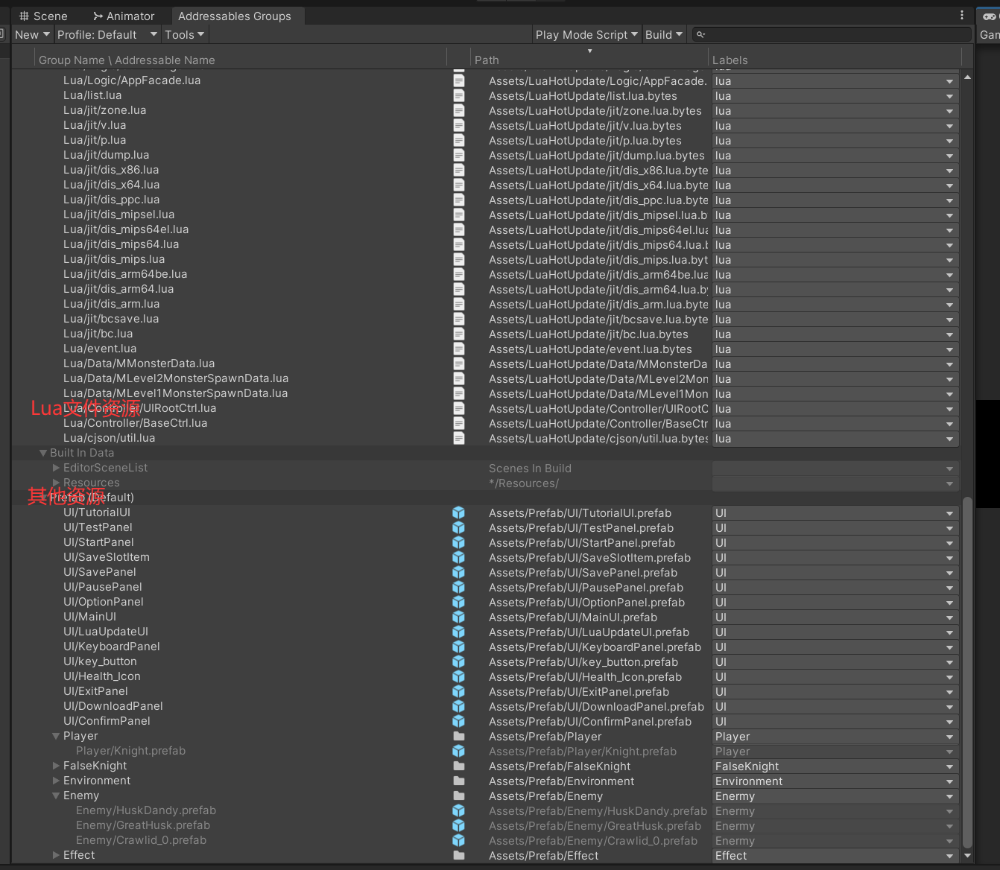

为了统一资源的加载与释放，我新增了ResourceManager + BundleManager这一套资源管理体系。它对上层脚本提供统一入口，对底层则封装Addressables的初始化、资源加载、实例化、引用计数与依赖下载逻辑。

这样做之后，游戏内的Prefab、图片、音频等资源都不必再分散地各自处理，而是通过同一套接口访问，便于后续扩展远端更新与缓存控制。

资源管理入口示例：

```csharp
public T Load<T>(string path) where T : UnityEngine.Object
{
	return BundleManager.EnsureInstance().LoadAsset<T>(path);
}

public GameObject InstantiatePrefab(string path, Transform parent = null)
{
	return BundleManager.EnsureInstance().Instantiate(BuildPrefabPath(path), parent);
}
```

在此基础上，我还实现了资源热更新流程：启动时先检查远端catalog是否更新，再统计下载量、显示下载进度，最后将需要的远端资源下载到本地缓存中。这样一来，后续资源内容更新时就不必每次都重新打整包。

资源更新流程中的关键代码：

```csharp
ReportProgress(onProgress, progress, "正在检查资源更新...", string.Empty, 0L, 0L, 0f, false, false);
AsyncOperationHandle<List<string>> checkHandle = Addressables.CheckForCatalogUpdates(false);
yield return checkHandle;

ReportProgress(onProgress, progress, "正在计算下载大小...", string.Empty, 0L, 0L, 0f, hasCatalogUpdate, false);
AsyncOperationHandle<long> sizeHandle = Addressables.GetDownloadSizeAsync(label);
yield return sizeHandle;
```

资源更新界面：

Lua下载与加载

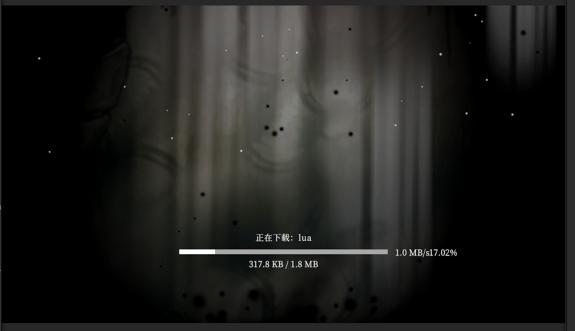

远程资源包检查、下载：
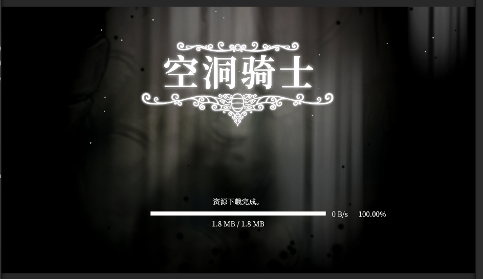

远端资源放在Github上：包含了所有Lua文件以及需要热更新的资源

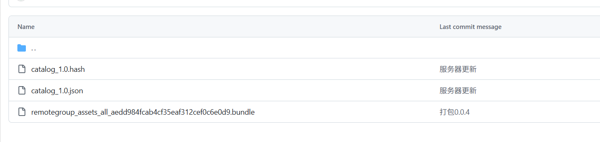

### （2）ToLua 热更新

除了资源热更新，我还补齐了 Lua 逻辑热更新能力。整体策略是：在Lua虚拟机启动之前，先下载远端 Lua文件并安装到本地热更目录，之后ToLua会优先从该目录读取Lua脚本。这样可以在不重发整包的前提下，更新UI逻辑和部分游戏逻辑。

这一部分我还配套实现了编辑器工具：自动扫描Assets/Lua与Assets/ToLua/Lua，复制到 Assets/LuaHotUpdate，转成 .bytes，生成LuaManifest.json，并自动配置Addressables地址，减少手工配置出错的可能。

Lua热更新核心流程示例：

```csharp
ResourceManager.EnsureInstance().CheckAndDownloadDependencies(
	ParseLabels(labels),
	status =>
	{
		if (status != null)
		{
			UpdateDownloadStatus(status);
		}
	},
	() => { downloadFinished = true; },
	message =>
	{
		downloadError = message;
		downloadFinished = true;
	});
```

安装Lua文件的关键代码：

```csharp
string fullPath = Path.Combine(LuaConst.luaResDir, relativePath);
string directory = Path.GetDirectoryName(fullPath);
if (!string.IsNullOrEmpty(directory))
{
	Directory.CreateDirectory(directory);
}

File.WriteAllBytes(fullPath, luaBytes);
```

Lua更新效果展示：

对于StartPanel：在lua代码中控制desc的text文本显示内容以实现热更新。

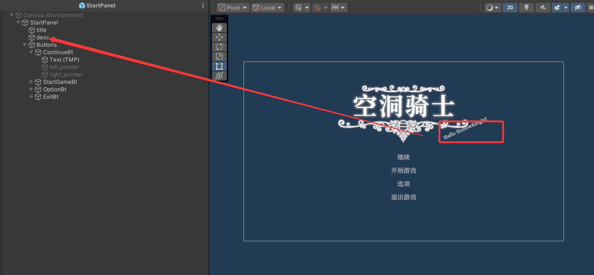

```lua
function StartPanel:InitUIAndMetaData()
	self.ui.continueButton = self.ui.root:Find("Buttons/ContinueBt"):GetComponent("UnityEngine.UI.Button")
	self.ui.startGameButton = self.ui.root:Find("Buttons/StartGameBt"):GetComponent("UnityEngine.UI.Button")
	self.ui.optionButton = self.ui.root:Find("Buttons/OptionBt"):GetComponent("UnityEngine.UI.Button")
	self.ui.exitButton = self.ui.root:Find("Buttons/ExitBt"):GetComponent("UnityEngine.UI.Button")
	self.ui.descText = self.ui.root:Find("desc"):GetComponent("TMPro.TextMeshProUGUI")
end
        
function StartPanel:RefreshView(data)
	if self.ui.continueButton ~= nil then
		self.ui.continueButton.gameObject:SetActive(SaveManager.HasAnySlot())
	end
	self.ui.descText.text = "Hey, Knight! " .. VERSION --这个版本号会根据服务器版本修改而同步更新修改
end
```

在PC打包后的真机环境下运行游戏：

之前的版本为0.0.3（VERSION=0.0.3）

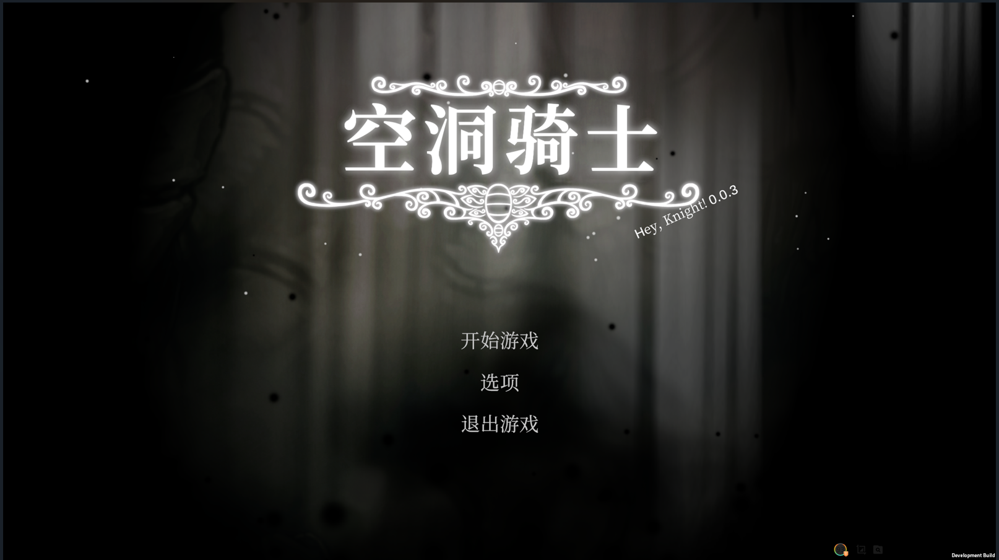

服务器更新：版本到0.0.4（VERSION=0.0.4）

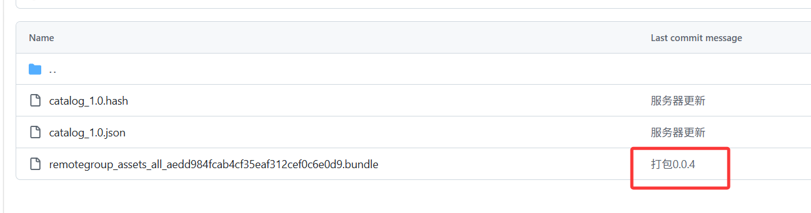

此时运行游戏：发现版本自动更新，即热更新成功！

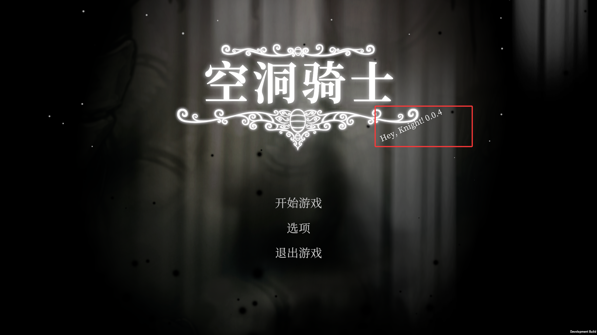

### （3）基于Lua的UI开发框架

在实习过程中，项目组开发UI的流程让我印象深刻，通过研究学习，我打算也建立一套自己的UI框架。

为了让UI更容易维护和热更新，我基于ToLua新搭建了一套Lua UI框架。其核心思路是：

C#负责底层资源、节点承载和跨场景生命周期，而Lua负责界面显示逻辑、事件绑定和业务刷新。

这一框架主要包括：

1.BasePanel.lua：提供面板基类与生命周期

2.UIPanelManager.lua：管理面板注册、打开、关闭、返回与销毁

3.PanelRegistry.lua：统一声明每个Panel的模块路径、Prefab路径和所在层级

原来的一批C# UI已经迁移到 Lua Panel体系中，例如开始界面、存档界面、确认弹窗、暂停界面、教学提示界面等。这样一来，后续UI迭代就可以更多地直接改 Lua，而不必频繁改 C#。

在架构上，这一套并不是严格照搬Web那种完整MVC，而是更适合单机游戏的简化MCV：

- Model/Data：主要由 Lua 配置表、运行时状态和各类 Manager 提供数据
- Control：由 UIPanelManager、UIRootCtrl、各类Lua Controller和部分C#管理器共同承担
- View：由各个Lua Panel、场景UI节点以及少量兼容桥接层负责显示与交互

这样做的原因很简单：单机项目不需要把每一层拆得特别重，否则开发复杂度会过高。所以我最终采用的是数据驱动+轻控制层+视图直连业务的方式，在保证结构清晰的同时，尽量让开发和迭代足够高效，尽可能保留实习期间学到的UI开发流程--多数时间在写View和MxxxData（策划配置表读取），Model、Ctrl大多和服务器交互、运行时数据有关。

**典型应用：**

其中比较典型的一块，就是配置Data + C#场景逻辑协作的刷怪系统。我把怪物模板参数放在 MMonsterData.lua中，例如 prefab 路径、血量、速度、预热数量、巡逻范围、尸体停留时间、复活时间等；再把每个场景的刷怪点配置放在MLevel1MonsterSpawnData.lua、MLevel2MonsterSpawnData.lua这类表中，描述具体刷怪位置、朝向、巡逻覆盖值和旧手摆怪隐藏名单。

MMonsterData

```lua
local MMonsterData = {
	Crawlid = {
		monsterId = "Crawlid",
		prefabPath = "Assets/Prefab/Enemy/Crawlid_0.prefab",
		poolPrewarm = 3,
		maxHealth = 2,
		blood = 5,
		speed = 2,
		keepCorpseAfterDeath = true,
		corpseDuration = 8,
		respawnTime = 15,
		patrol = {
			xMin = -6,
			xMax = 6,
		},
	},
    ...
```

MLevel1MonsterSpawnData

```lua
spawns = {
		{
			spawnId = "level1_crawlid_01",
			monsterId = "Crawlid",
			position = { x = 17.97, y = -0.26999998, z = 0 },
			faceRight = true,
			patrol = { xMin = -6, xMax = 6 },
		},
		{
			spawnId = "level1_crawlid_02",
			monsterId = "Crawlid",
			position = { x = 5.28, y = -0.050000012, z = 0 },
			faceRight = true,
			patrol = { xMin = -6, xMax = 6 },
		},
```

进入场景后，C#的EnemySpawnBootstrap会通过LuaState读取这些Data表，完成对象池预热、隐藏旧怪、生成新怪与应用参数覆盖。这样后续新增关卡时，通常只要补一张Lua配置表，而不必反复改刷怪入口代码。

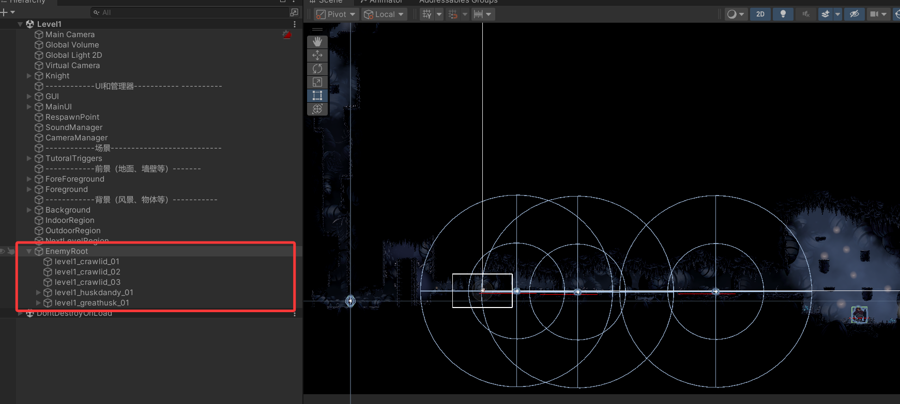

而且采用Lua作为数据配置表可以方便扩展：UI那边可以轻松的读取到怪物生成数据，如果要做小地图之类的功能，会十分方便。

**C#与Lua**

C#与Lua的协作关系也比较明确：C#负责Unity 原生能力，Lua负责业务层表达。例如C#侧负责 ResourceManager、UIManager、GameManager、Prefab加载、场景生命周期、热更新前置流程；Lua侧则通过PanelRegistry、UIPanelManager、BasePanel负责面板注册、打开关闭、事件绑定、文本刷新和交互逻辑。Lua在C#的上层。

BasePanel 的显示逻辑如下：

```lua
function BasePanel:Show(data)
	self.visible = true
	self.data = data

	if not self.isInited then
		if self:CreateGameObject() == nil then
			self.visible = false
			return
		end

		self:InitUIAndMetaData()
		self:InitUIEvent()
		self.isInited = true
	end

	self:OnOpen(data)
	self:RefreshView(data)
end
```

面板管理的打开逻辑如下：

```lua
function UIPanelManager.Open(name, data)
	local panel = panelInstances[name]
	if panel == nil then
		panel = createPanel(name)
		panelInstances[name] = panel
	end

	panel:Show(data)
	removeFromStack(name)
	table.insert(panelStack, name)
	return panel
end
```

**Lua虚拟机**

Lua接入游戏本身的方式也比较清晰：游戏启动后，并不是立刻直接执行Main.lua，而是先由 LuaClient在Awake()中触发启动流程，先完成 Lua 文件热更新与安装；然后再初始化LuaState、注册 Wrap、启动LuaLooper，最后执行Main.lua，进入AppFacade.Start()、CtrlManager.StartUp()和 UIRootCtrl.Start()。在UIRootCtrl中，Lua会初始化UIPanelManager、注册PanelRegistry，再根据当前场景决定打开DownloadPanel、StartPanel或跳过启动UI。这样，Lua不是孤立挂进去的脚本层，而是已经真正接入了项目的启动流程、场景切换和UI生命周期。

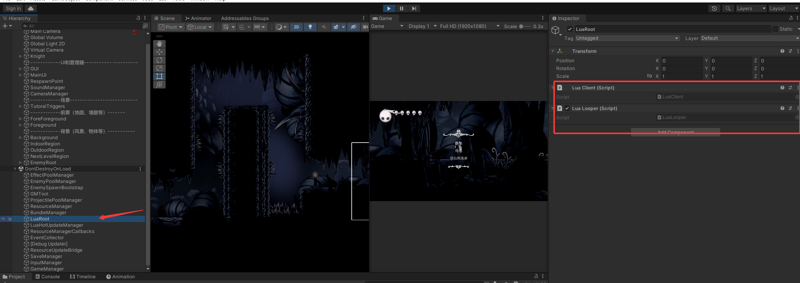

### （4）对象池

项目完成之后，我学到了一些新技术，对象池/内存池十分适合用来优化我的项目！

场景中频繁出现的小怪、受击特效、剑气命中特效、火球、冲击波等对象都会频繁生成和销毁。为减少运行时开销并提升整体稳定性，我实现了多套对象池：

怪物对象池EnemyPoolManager

特效对象池EffectPoolManager

投射物对象池ProjectilePoolManager

对象池的基本思想是：对象第一次需要时创建，之后不再销毁，而是在不用时隐藏并回收到池中；下次使用时直接取出复用。这对于高频对象尤其有效。

怪物对象池的生成逻辑示例：（其他的思路）

```csharp
public GameObject Spawn(string prefabPath, Vector3 position, Quaternion rotation, Transform parent = null)
{
	PooledEnemy pooledEnemy = Acquire(prefabPath);
	Transform enemyTransform = pooledEnemy.transform;
	enemyTransform.SetParent(parent, false);
	enemyTransform.position = position;
	enemyTransform.rotation = rotation;
	pooledEnemy.gameObject.SetActive(true);
	pooledEnemy.NotifyAfterSpawn();
	activeEnemies.Add(pooledEnemy);
	return pooledEnemy.gameObject;
}
```

每个怪物实现IPoolableEnemy的接口：创建、销毁

```c#
    public void OnSpawnFromPool()
    {
        EnsureInitialized();
        startPosition = transform.position;
        isTurning = false;
        isMoveRight = true;
        blood = enermyHealth != null ? enermyHealth.max_health : blood;
        transform.localScale = new Vector3(Mathf.Abs(originalScale.x), originalScale.y, originalScale.z);
        if (animator != null)
        {
            animator.SetBool("Die", false);
            animator.SetBool("turn", false);
            animator.Rebind();
            animator.Update(0f);
        }
    }

    public void OnDespawnToPool()
    {
        EnsureInitialized();
        isTurning = false;
        blood = enermyHealth != null ? enermyHealth.max_health : blood;
    }
```

实际运行效果：可以看到被击杀的怪物进入池内，播放完的特效也进入池内，如果再次使用，会将它们激活，不用再new一个

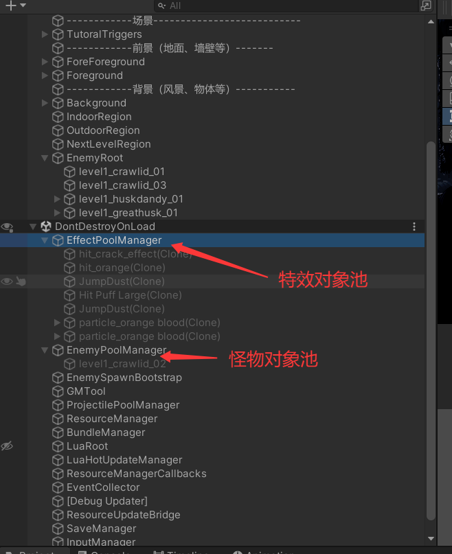

### （5）存档系统

我还实现了第一版存档系统。当前支持最多 10 个存档槽位，采用 JSON 文件落盘，存储在 Application.persistentDataPath下。每个存档会记录：

当前关卡、玩家位置、最近安全点、生命值、能量值、游玩时长、存档时间

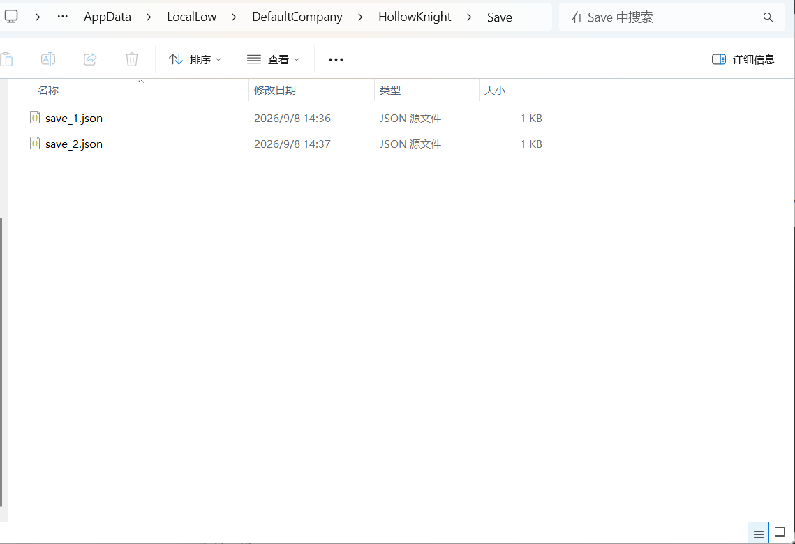

在主菜单中，玩家可以进入存档界面，选择读档、新游戏、继续最近存档、覆盖存档、删除存档等。

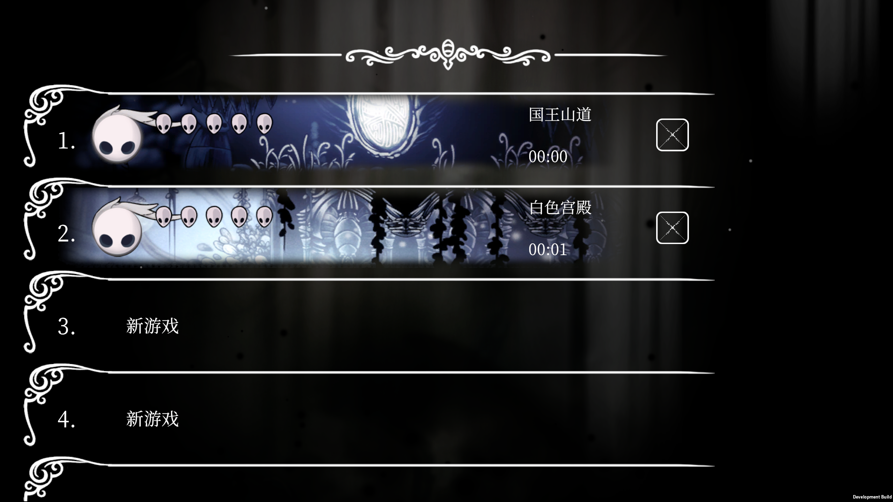

存档写入的关键代码如下：

```csharp
SaveData data = new SaveData
{
	version = CurrentVersion,
	slotId = slotId,
	sceneName = sceneName,
	playerX = savePosition.x,
	playerY = savePosition.y,
	currentHealth = playerHealth.current_health,
	maxHealth = playerHealth.max_health,
	currentSoulPower = playerSoulPower.CurrentSoulPower,
	maxSoulPower = playerSoulPower.maxSoulPower,
	saveTime = DateTime.Now.ToString("yyyy-MM-dd HH:mm:ss")
};

Directory.CreateDirectory(GetSaveFolderPath());
File.WriteAllText(GetSaveFilePath(slotId), JsonUtility.ToJson(data, true));
```

读档后恢复玩家状态的关键代码如下：

```csharp
player.transform.position = playerPosition;
rb2d.velocity = Vector2.zero;
rb2d.angularVelocity = 0f;
rb2d.simulated = true;

playerHealth.ApplySaveData(pendingLoadData.currentHealth, pendingLoadData.maxHealth, respawnPosition);
playerSoulPower.SetSoulPower(pendingLoadData.currentSoulPower, pendingLoadData.maxSoulPower);
```

### **（6）编辑器工具**

为了减少这一阶段反复的手工操作，我还补充了一些编辑器工具，主要服务于Lua热更新资源同步与 UI 开发流程。这样在每次修改Lua或新增 UI 后，不必再手动复制文件、修改后缀、配置 Addressables 和维护注册信息，能明显减少出错概率。

其中最核心的是LuaHotUpdateSyncTool.cs，菜单入口如下：

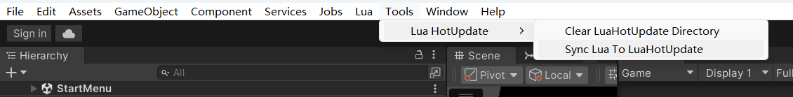

执行后，它会自动扫描Assets/Lua与Assets/ToLua/Lua，同步到Assets/LuaHotUpdate，将Lua文件转成.bytes，生成LuaManifest.json，从Main.lua中读取VERSION，并自动配置Addressables的 Address 与Label。除此之外，它还会统一规范Assets/Prefab/UI下各个UI Prefab的Address，避免真机环境下因为地址不一致而加载失败。

另外，我还补了Panel相关的辅助工具，例如快速创建Panel Lua文件、重建PanelRegistry等，让后续新增Lua UI时接入流程更加顺畅，大幅提高开发UI的效率。

对着Prefab创建Lua：

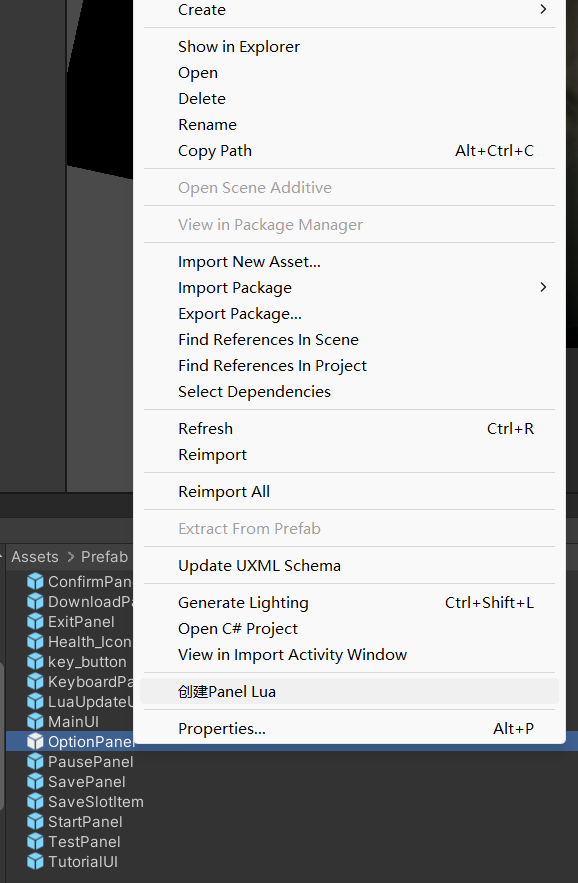

生成初始模板：

```lua
local BasePanel = require "View.BasePanel"

local OptionPanel = BasePanel.New()

function OptionPanel.New()
	return OptionPanel:CreateInstance()
end

function OptionPanel:Ctor()
end

function OptionPanel:InitUIAndMetaData()
	-- 在这里查找并缓存 UI 节点。
	-- 示例：self.ui.confirmButton = self.ui.root:Find("Buttons/ConfirmBt"):GetComponent("UnityEngine.UI.Button")
end

function OptionPanel:InitUIEvent()
	-- 在这里绑定按钮、Toggle、列表项点击等事件。
end

function OptionPanel:OnOpen(data)
	self.state.openParam = data
end

function OptionPanel:RefreshView(data)
	-- 在这里根据 data 或 self.state 刷新文本、图片、列表和显隐状态。
end

function OptionPanel:OnHide()
end

function OptionPanel:OnDispose()
end

return OptionPanel

```

### （7）其他功能完善与 Bug 修复

除了上述系统，这一阶段还完成了许多对项目体验影响很大的细节完善。例如：

- 统一启动前资源下载与 Lua 更新界面的显示逻辑
- 修复真机环境下 LuaUpdate 界面的 TMP 字体丢失问题
- 修复 TutorialUI 在真机触发器退出时的空指针问题
- 修复返回主菜单后二次进入关卡无法暂停的问题
- 优化主菜单、暂停、读档流程中的鼠标光标显示与隐藏
- 将一批原本为英文的界面文本改为中文，统一整体语言风格

至此，这个项目已经不仅仅是一个基础的玩法复刻练习，而是具备了资源管理、热更新、Lua UI、对象池、存档系统与真机调试修复能力的完整游戏工程。

后续可以优化：
1.存档时机

2.支持移动端

3.基于Lua开发更多游戏内UI

......


